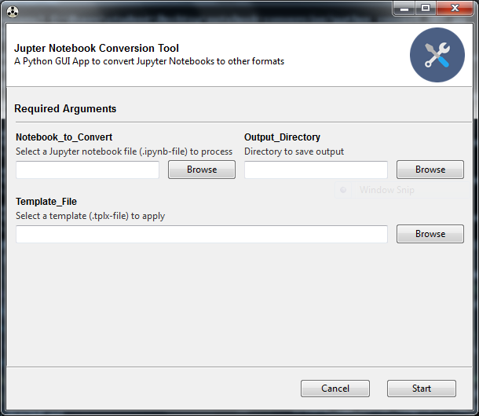

# notebook-conversion-tools

A repo of Jupyter notebook conversion tools. These tools convert Jupyter Notebooks into LaTeX .tex and pdf



## To use the GUI locally

To run the Jupyter Notebook conversion GUI locally, start out by downloading and installing [Anaconda](https://docs.anaconda.com/anaconda/) or [Miniconda](https://conda.io/miniconda.html).

### Install Anaconda or Miniconda

Go to [https://anaconda.com/downloads](https://anaconda.com/downloads) and install Anaconda or Miniconda for your operating system.

### Clone the repo

Open the Anaconda Prompt (or Terminal prompt on MacOS, and Linux) and navigate to your desired location. Clone the repo from GitHub.

```text
$ cd ~     # or where you want the project to be saved
$ git clone https://github.com/ProfessorKazarinoff/notebook-conversion-tools
```

### Create a virtual environment

After the repo is copied locally, the next step is to create a virtual environment with **conda**. Adding the ```-f environment.yml``` to the command will install most of the required packages. This step may take a minute or two as **conda** checks the environment.


```text
$ cd notebook-conversion-tools
$ conda env create -f environment.yml
```

Now that the virtual environment and packages are all installed, activate the virtual environment and run the script that start the GUI.

### Activate virtual environment and Start the GUI

The virtual environment created in the last step is called ```convenv```. Activate it with the ```activate``` command. Before running the GUI, install the [**Gooey**](https://github.com/chriskiehl/Gooey) module from PyPI with **pip**. The **Gooey** module is not available in the default conda channel or in **conda-forge**. Finally, run the ```convert_GUI.py``` script and convert some Jupyter notebook files to LaTeX.

```text
$ conda activate convenv
(convenv)$ pip install gooey
(convenv)$ python convert_GUI.py
```
